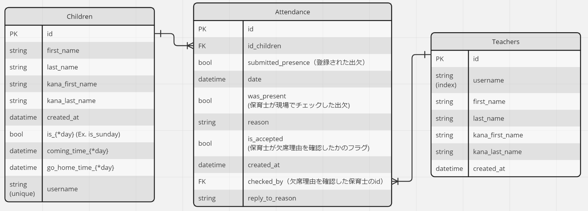

# API_DOCUMENT
- 出席管理APIドキュメント
- 機能は園児(保護者)向け、保育士向けのものがある。

## パラメータ一覧

|parameter|type|description|
---|---|---
|`id_children`|`int`|園児を識別するID|
|`date`|`string(YYYY_MM_DD)`|出欠予約を登録する(した)日付|
|`reason`|`string`|欠席理由|
|`submitted_presence`|`bool`|登録する出欠(出席がTrue)|
|`reply_to_reason`|`string`|欠席理由に対する返信|
|`was_present`|`bool`|実際の出欠(出欠していればTrue)|

## データベース構造

## 園児(保護者)向け

### `/api/children/reserve` 
- 指定日、指定園児の出欠予約の登録、確認、更新ができる。

|function|method|parameter|supplement|
---|---|---|---
|出欠予約の登録情報を確認する|GET|`id_children` `date`|-|
|出欠予約を登録する|POST|`id_children` `date`  `submitted_presence` `reason`|`reason`は任意項目|
|出欠予約の登録情報を更新する|PUT|`id_children` `date` `submitted_presence` `reason`|`reason`は任意項目|

## 保育士向け
### `/api/teachers/reserve`
- 指定日、指定園児の出欠予約の検索、登録、欠席理由への既読チェック、返信ができる。

|function|method|parameter|supplement|
|---|---|---|---|---|
|出欠予約の登録情報を検索する|GET|`id_children` `date`|`id_children`,`date`は片方でOK|
|出欠予約を登録する|POST|`id_children` `date`  `submit_attendance`|`reason`は任意項目|
|欠席理由への既読チェック、返信|PUT|`id_children` `date` `submitted_presence` |`reply_to_reason`は任意項目|

### `/api/teachers/list`
- 指定日の全園児の出欠予定状況の閲覧、実際の出欠状況の確認の投稿を行う。
  - 出欠「予定」としているのは、 1. 不定期で出席予約を行うケース 2. 予約を行わず固定の曜日に出席を予定するケース の2つがあることを考慮しているからである。

|function|method|parameter|supplement|
---|---|---|---
|出欠予約の閲覧|GET|`date`|その日出席を予約をしている園児&毎週その曜日に出席することになっている園児の出欠状況が**jsonから成る配列**として返却される。 `[{'id_children':<int>,'first_name': <string>, 'last_name': <string>, 'attend': <bool>(その日の出欠予定), was_present:<bool>}`|
|実際の出欠状況と予約の一致の確認を投稿|POST PUT|GETで受け取るのと同様の形式のデータ(JSON配列)|基本的には、`was_present:<bool>`のみ更新が行われる想定|
