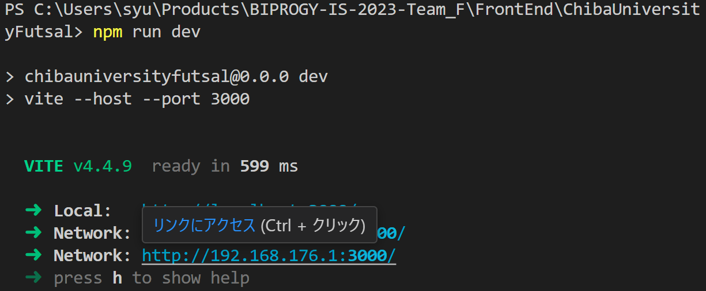
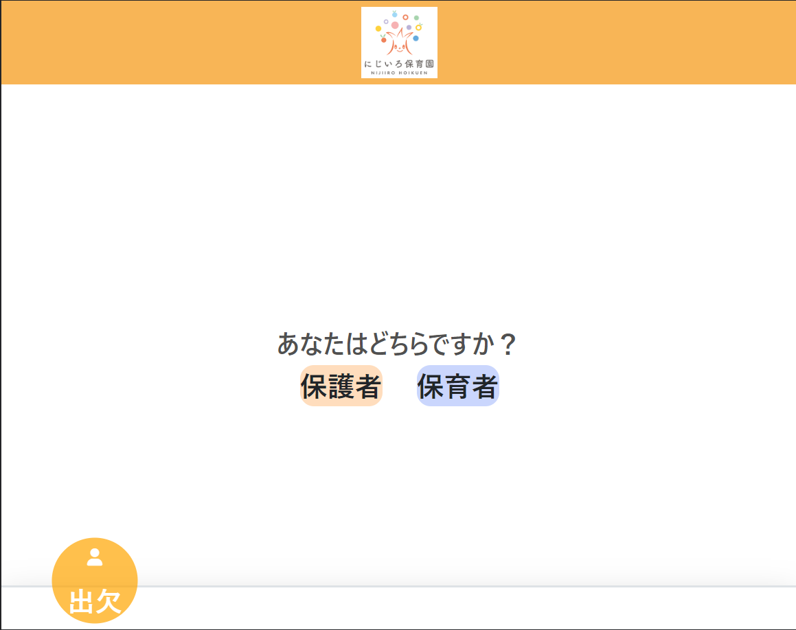
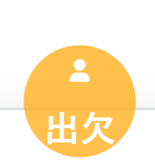
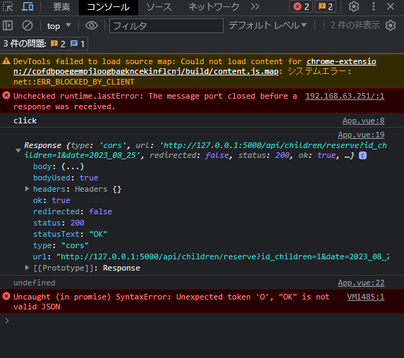

#デモの使い方

## フロント環境情報
以下をご用意ください。
* Node.js : v18.15.0
* npm : 9.5.0

## フロントエンド起動方法
1. FrontEnd/ChibaUniversityFutsal/ に移動
```bash
cd FrontEnd/ChibaUniversityFutsal/
```
2. パッケージのインストール
```bash
npm install
```
3. フロントエンドの起動
以下でローカルでWebサーバーが起動します。
```bash
npm run dev
```
4. ブラウザでアクセス
以下の内容が表示されるので、`Network`のアドレスにアクセスしてください。\
3つ表示された場合は2番目のアドレスにアクセスして下さい。


5. このような画面が表示されれば成功です。


## APIテスト方法
6. 「出欠」と記載のあるボタンを押下すると、サーバーに対してPOSTリクエストを送信します。

押下後、以下のようなコードが実行されます。
    ```javascript
    const clickHandler = () => {
    console.log("click");

    const formData = new FormData();
    formData.append("submitted_presence", "True");
    formData.append("reason", "TEST");

    fetch('http://127.0.0.1:5000/api/children/reserve?id_children=1&date=2023_08_28', {
        method: 'POST',
        body: formData
    })
    .then(response => response.json())
    .then(data => console.log(data))
    .catch(error => console.error('Error:', error));
    }
    ```
7. 押下後、ブラウザのコンソール画面でPOST結果を確認することができます。

このように、`status`が`200`であることを確認できます。
