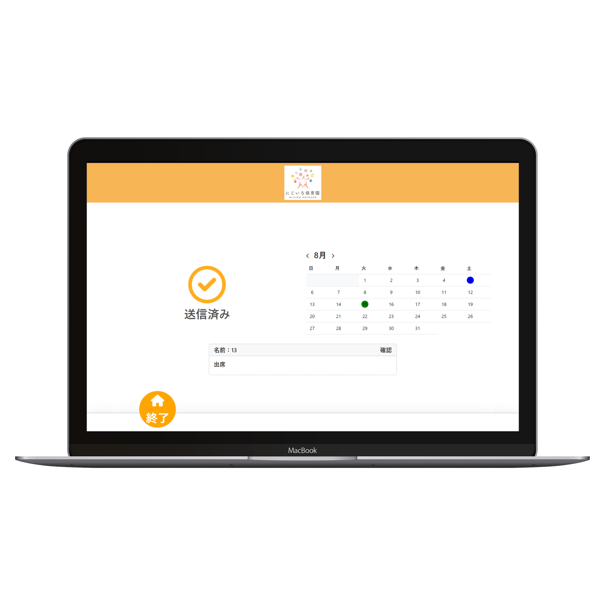
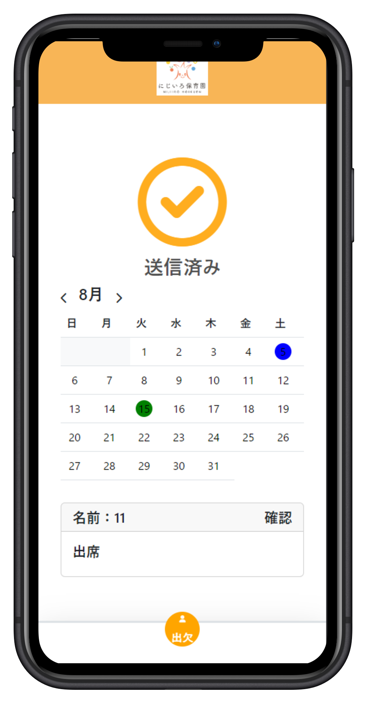
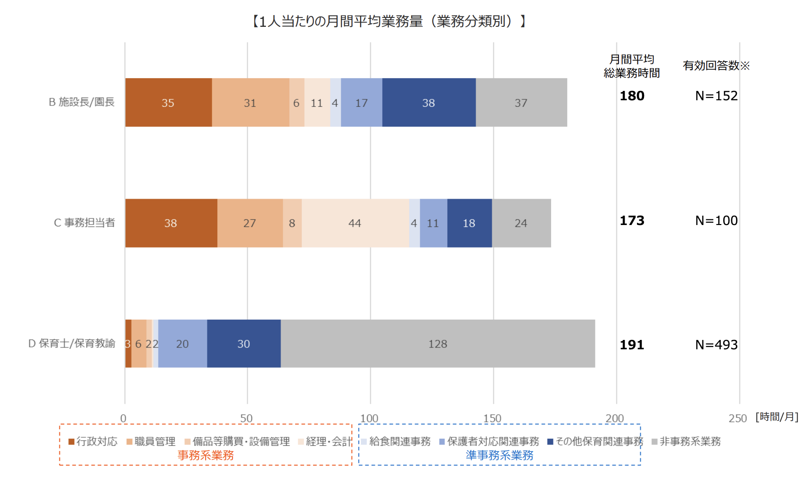

# BIPROGY Software Engineer 5 days Internship

# チームF：千葉大学フットサル部

# プロダクトバックログ（コース）の選択

__チーム側__  __の視点：__

__メンバーのバックグラウンドがかなり異なり、__  __共通して使える技術がほとんどない。__

__メンバーのスケジュールの都合上、__  __学習コストの高い技術を学ぶ時間が確保できない。__

__ステークホルダー側の視点：__

__保育士の負担__  __が大きな課題__

__\(出典：保育現場の働き方改革に関するアンケート調査__  _[https://www\.pref\.oita\.jp/uploaded/attachment/2029582\.pdf](https://www.pref.oita.jp/uploaded/attachment/2029582.pdf)_  __）__

__保育士の業務負担軽減が目的__ ＆ __基礎的な実装が多い出欠管理のコースを選択__

# プロダクトバックログ（①出欠管理改善コース）

| 機能 | 内容 | 優先度 |完遂|
| :-: | :-: | :-: |:-:|
|  | 【保護者用】自分の子供の出欠を登録できる | 1 |✅|
|  | 【保護者用】欠席の場合、欠席理由を記入することができる | 2 |✅|
|  | 【保育士用】出欠登録機能の画面で、園児の一覧と出欠状態を確認できる | 3 |✅|
| 出欠管理 | 【保育士用】複数の保育士が対象の園児を選択し、出欠状態と欠席理由を確認することができる | 4 |✅|
|  | 【保護者用】保護者記入の欠席理由を確認し、返信することができる | 5 |✅|
|  | 【保護者用】保育士記入の返信欄を確認することができる | 6 |✅|
|  | 【保護者用/保育士用】過去に記録した出欠状態を一覧化して確認することができる | 7 |✅|
| 連絡帳 | 【保護者用/保育士用】保護者と保育士が連絡を取るためにチャットできる | 8 |✖|

# ステークホルダーへの配慮

## レスポンシブ対応

デバイスに応じて __最適なレイアウト__ を提供します。

## 過去の出欠を確認できるカレンダー

園児の過去の出席情報を __直感的に__ 確認できます。

## シンプルなUI

1つのページの機能が少なく、 __簡単に__ 操作を行えます。
1画面1操作のUIで、わかりやすい

# プロダクトデモ

## 技術スタック

 __バックエンド：Python/Flask__ 

 __フロントエンド：Vue\.js__ (Vue3)

# 継続的な改善に向けて　～反省点～

1. DB操作ライブラリの仕様の把握に時間がかかってしまった。

2. 使用する __技術の調査__ をバックログに含める。

3. 議論不足により明確な独自性を持たせられなかった。

4. __独自性を含めたプロダクトの軸__ を最初に設定する。

5. FE\, BE間で、API仕様の共有が不十分だった。

6. 共有すべき内容を __事前にリストアップ__ しておく。

# 継続的な改善に向けて　～追加したい機能～

1. __データ分析による__  __欠席対策の提案__

2. 蓄積される欠席日時や理由のデータから、欠席対策を提案

3. __時間帯も含めた__  __出欠管理__

4. 登園・退園時刻を考慮した出欠管理を実現

5. __兄弟のいる__  __世帯__  __での__  __効率的な出欠管理__

6. __家族に園児が複数いても__  __出欠の登録、確認を簡単に__

# Thank you!

# Supplement

# ステークホルダーへの配慮（仮）

* _欠席連絡への返信文_ を考えるのは、 __少し負担がかかる。__
  * 急務は  __欠席連絡を確認したと伝える__  こと。

* 保育士は、 __登録__ と __実際の出欠状況__ を確認する必要がある。
  * __欠席連絡があった園児が来てしまっていないか\.\.\.?__

__既読を示すチェックボックスを実装__ 返信文をすぐに書かなくてもOK

__確認用のチェックボックスを実装__ 保護者側も確認済みかを見られる。

# 実現したいこと

| 業務時間の割合 |
| :-: |
| 子どもと直接的に接する業務（コンタクトタイム）66.1％ |
| 事務作業・裏方業務（ノンコンタクトタイム）33.9％ |

__「保育士の負担」を軽減したい__

__保育士の作業量を減らしたい__

__電話での対応を減らす__

__好きな時間に出欠の管理できるようにする__

__保護者との連絡を手軽にする__

__保育士のノンコンタクトタイムを減らし、__  __園児と向き合う時間を増やしたい__

（出典：  東京都福祉局  「  保育事業者の事務負担軽減等に関する調査・分析　報告書  」/  _[https://www\.fukushi\.metro\.tokyo\.lg\.jp/kodomo//hoiku/jimuhutan\.files/03\.pdf](https://www.fukushi.metro.tokyo.lg.jp/kodomo//hoiku/jimuhutan.files/03.pdf)_  ）

# 今後に向けて　～学びと改善～

### __学び・反省・苦労__

1. 普段馴染みのない言語・フレームワークでの開発だった

2. 限られた時間の中での開発で、プラン通りに行かなかった

3. スプリントバックログの決定の際の見通しが甘かった

4. 追加機能を実装したかったが、時間がなかった

5. 自分たちのプロダクトの独自性を明確にしていなかった

# 謝辞
五日間ありがとうございました！。Day0から皆様積極的に取り組んで頂き、チームとして完成度はかなり高いところまで持って行けたと思っています。

私個人としても今回のスクラム開発を通じて、技術の事だけでなく、多くの事を学べる大変貴重な機会となりました。5日間という短い期間ではありましたが、それ以上に多くのものを得ることができました。感謝いたします。

もしまた選考ないしはインターン、はたまた仕事にてお会いすることがあれば、本チームでの開発のお話で盛り上がれればと思います。

改めまして、5日間このチームで苦楽をともに開発を行えたことを大変嬉しく思います。ありがとうございました。

